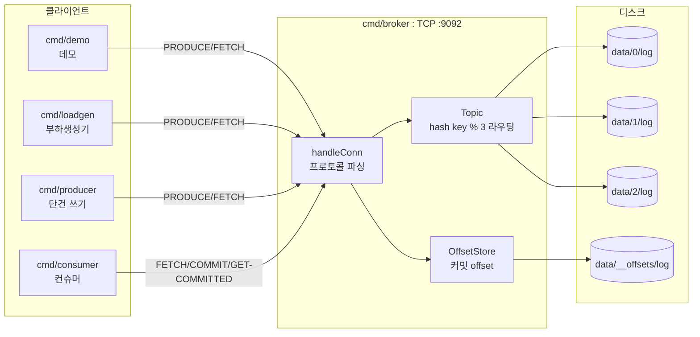

# MiniKafka

Go로 밑바닥부터 구현한 **카프카식 로그 기반 메시지 브로커**. append-only 로그, 키 해시 파티셔닝, offset 기반 소비, 컨슈머 그룹, 그리고 fsync 정책별 **내구성-처리량 트레이드오프 벤치마크**까지 직접 만들어 검증했다.

> 학습 목적 프로젝트 — 카프카가 *왜* 그렇게 설계됐는지(오프셋, 파티셔닝, fsync)를 손으로 만들며 이해한다. 단일 노드. 복제(replication)는 스코프 밖(v2).

---

## 한눈에 보는 결과

- 단일 브로커 **26,821 msg/s**, **p99 77µs** (OS 위임 정책, 20k produce, macOS)
- 10만 건 produce → **유실 0**으로 전부 소비
- fsync 정책 3종 벤치마크로 내구성-처리량 트레이드오프 **측정하고 선택**

---

## 아키텍처



**계층:**
- `internal/log` — 코어. append-only 로그(`Log`), 파티션 라우팅(`Topic`), 커밋 저장소(`OffsetStore`)
- `internal/client` — 얇은 클라이언트 라이브러리 (`Produce`/`Fetch`/`Commit`/`GetCommitted`)
- `cmd/broker` — TCP 브로커
- `cmd/producer` — 단건 produce (CLI, 컨슈머의 짝)
- `cmd/consumer` — 파티션 소비 + offset 커밋
- `cmd/demo` — produce→fetch 왕복 데모
- `cmd/loadgen` — 부하 생성 + 처리량/지연 측정

**저장 포맷:** 각 레코드는 `[4바이트 길이(빅엔디안)][payload]`. offset은 파일 내 **byte 위치**.

---

## 빌드 & 실행

```bash
# 요구: Go 1.24+
go build ./...        # 전체 빌드
go test ./...         # 전체 테스트
```

### 브로커 구동

```bash
go run ./cmd/broker [--fsync N]
```

- `:9092`에서 TCP 리스닝. 커넥션마다 goroutine.
- `data/` 밑에 파티션 폴더(`0`, `1`, `2`)와 `__offsets` 자동 생성.
- **`--fsync N`** — 디스크 동기화 정책 (아래 [fsync 실험](#fsync-실험) 참고). 기본 `0`.

> **리셋:** 브로커를 끈 뒤 `rm -rf data` 하고 다시 켠다. (브로커 켜진 채 `data`를 지우면 메모리 상태가 꼬인다.)

---

## 구성 요소 실행법

### cmd/producer — 단건 produce
```bash
go run ./cmd/producer --key user-42 --payload "안녕"
```
`--key`로 파티션을 정하고 `--payload`를 그 파티션에 하나 쓴다. 반환된 partition/offset 출력. `cmd/consumer`의 짝.

### cmd/demo — produce→fetch 왕복 데모
```bash
go run ./cmd/demo
```
key `"user-1"`로 메시지 하나를 produce하고, 반환된 (partition, offset)으로 다시 fetch해서 출력. 프로토콜 왕복이 되는지 확인용.

### cmd/loadgen — 부하 생성 + 측정
```bash
go run ./cmd/loadgen [--events N] [--keys K]
```
- `--events` produce할 건수 (기본 30000)
- `--keys` 키 종류 수 (기본 100) — 파티션 분산에 영향
- 출력: 파티션 분포 + `N건 | 처리량 | p50 | p99`

### cmd/consumer — 컨슈머
```bash
go run ./cmd/consumer --partitions 0,1 --group demo
```
- `--partitions` 담당 파티션 (쉼표 구분, 예: `0,1` 또는 `2`)
- `--group` 컨슈머 그룹 이름
- 담당 파티션마다 **커밋된 offset부터** fetch → 처리(출력) → 드레인 후 커밋. 재시작하면 커밋 지점부터 이어읽는다.

---

## fsync 실험

이 프로젝트의 핵심 실험. **`Log.Append`가 `Write`(페이지 캐시) 뒤에 `fsync`(디스크 강제 동기화)를 언제 호출하느냐**를 `--fsync N`으로 바꾼다:

| `--fsync` | 의미 | 정책 |
|---|---|---|
| `0` | 절대 fsync 안 함 | **OS 위임** — 가장 빠름, 전원손실 시 유실 |
| `1` | 매 write마다 fsync | **매번** — 가장 느림, 응답=디스크 보장 |
| `N` (예: 100) | N건마다 fsync | **배치** — 중간, 크래시 시 최대 N건 유실 |

### 직접 돌려보는 법 (터미널 2개)

각 정책마다 **브로커를 껐다 켜고** loadgen으로 측정한다:

```bash
# --- 정책 0 (OS 위임) ---
# 터미널 1:
rm -rf data && go run ./cmd/broker --fsync 0
# 터미널 2:
go run ./cmd/loadgen --events 20000 --keys 100
# → 처리량/p50/p99 기록. 터미널 1 Ctrl-C.

# --- 정책 100 (배치) ---
rm -rf data && go run ./cmd/broker --fsync 100    # 터미널 1
go run ./cmd/loadgen --events 20000 --keys 100    # 터미널 2

# --- 정책 1 (매번) ---
rm -rf data && go run ./cmd/broker --fsync 1       # 터미널 1
go run ./cmd/loadgen --events 20000 --keys 100     # 터미널 2 (느리니 인내)
```

세 번의 처리량/p50/p99를 비교하면 트레이드오프가 숫자로 보인다.

### 산출물 해석 — 벤치마크 결과

macOS, 2–5만 건 produce 기준.

**세 정책 요약:**

| fsync 정책 | 처리량 | p50 | p99 | 내구성 |
|---|---|---|---|---|
| `0` (OS 위임) | **26,821/s** | 33µs | 77µs | 최저 (전원손실 시 유실) |
| `100` (배치) | **14,829/s** | 30µs | **996µs** | 중간 (최대 100건 유실) |
| `1` (매번) | **232/s** | 4.0ms | 9.1ms | 최고 (응답=디스크 보장) |

**배치 크기별 곡선 (`--fsync N` 스윕):**

| `--fsync` (N) | 처리량 | 천장 대비 | p99 | 크래시 시 유실 |
|---|---|---|---|---|
| `1` | 232/s | ~1% | 9.1ms | 0건 (보장 범위) |
| `10` | 1,874/s | ~7% | 4.76ms | ≤10건 |
| `50` | 7,544/s | ~28% | 3.69ms | ≤50건 |
| `100` | 14,829/s | ~55% | 996µs | ≤100건 |
| `1000` | 23,590/s | ~88% | 87µs | ≤1000건 |
| `0` (=∞) | 26,821/s | 천장(100%) | 77µs | fsync 안 함 |

곡선의 모양 — **처리량 = 1 / (기본비용 + fsync비용/N)**:
- **낮은 N (1~100):** N에 거의 **선형** 증가 (N×2 → 처리량 ~×2). fsync 비용(~5ms)이 지배하고 N건에 나눠 부담된다.
- **높은 N (100~1000):** **천장으로 포화** (N×10 → ×1.6뿐). fsync 비용이 0에 수렴하고 기본비용(네트워크+Write, ~40µs)만 남는다.
- **천장(~26k/s)을 못 넘는다.** 배치를 아무리 키워도 fsync 없는 처리량이 상한이다. 로그 곡선처럼 무한히 오르는 게 아니라 천장에 붙어 멈춘다.

**읽는 법:**
- **매번 fsync는 OS위임보다 ~115배 느리다** (26821→232). 내구성의 대가가 처리량. 매 produce가 디스크 쓰기를 기다린다.
- **배치가 스위트스팟** — 곡선의 knee(무릎)는 N≈100~1000. 여기서 천장의 55~88% 처리량을 회복하면서 유실 창을 유한하게 제한한다. 그 이상 N을 키우면 처리량 이득은 거의 없이 유실 창만 넓어진다(무의미). 실무가 배치+주기 커밋을 쓰는 이유.
- **왜 p50이 아니라 p99인가:** 배치(100)의 p50=30µs(대부분 빠름)인데 **p99=996µs** — 매 100번째 produce가 fsync 스파이크를 겪는다. **평균을 냈으면 이 주기적 스파이크가 뭉개져 안 보였을 것.** p99가 "1%의 나쁜 경험"을 정확히 드러낸다.
- **macOS 캐비아:** macOS의 `fsync`는 드라이브 자체 캐시까지는 강제하지 않는다(진짜 보장은 `F_FULLFSYNC`). 따라서 위 `fsync=1`의 232/s는 실제 물리 내구성 비용을 **과소평가**한 값이다. Linux에서는 더 느리다.

---

## 유실 없음 검증 (10만 건)

```bash
rm -rf data && go run ./cmd/broker --fsync 0     # 터미널 1
# 터미널 2:
go run ./cmd/loadgen --events 100000 --keys 100  # 10만 건 produce
go run ./cmd/consumer --partitions 0,1,2 --group verify | wc -l   # 소비 건수
```
소비 건수가 **100000**이면 유실 0. (검증된 결과: 저장 P0+P1+P2 = 100000, 소비 100000.)

> 파티션 파일의 레코드 수는 `$(stat -f%z data/0/log) / 9`로도 확인 가능 (loadgen payload `"event"` 기준 레코드당 9바이트 = 4헤더 + 5payload).

---

## 테스트

```bash
go test ./...                          # 전체
go test -run TestConcurrentAppend -race ./internal/log   # 특정 + 레이스 탐지
go test -count=1 ./internal/log        # 캐시 무시하고 재실행
```

| 테스트 | 검증 목적 |
|---|---|
| `TestAppendRead` | Append→Read 왕복, 여러 건, **재시작 후 데이터 생존**(복구) |
| `TestConcurrentAppend` | 동시 Append 시 **offset 중복 없음** (mutex 동작). 논리 레이스라 `-race`론 안 잡히고 유니크성 assertion으로 검증 |
| `TestPartitioning` | **같은 키 → 같은 파티션**, 키 단위 순서 |
| `TestOffsetCommitRecover` | offset 커밋 → **재시작 후 복원(replay)**, 최신 커밋 승, 커밋 없으면 0 |

### 통합 데모 (수동)

**재시작 재개:**
```bash
go run ./cmd/demo; go run ./cmd/demo; go run ./cmd/demo   # 3건 produce (파티션 1)
go run ./cmd/consumer --partitions 1 --group demo      # 3건 소비 + 커밋
go run ./cmd/consumer --partitions 1 --group demo      # 아무것도 안 나옴 = 재개 성공
```

**파티션 분할 (컨슈머 2개):**
```bash
go run ./cmd/loadgen --events 30000
go run ./cmd/consumer --partitions 0,1 --group split | wc -l   # ≈ P0+P1
go run ./cmd/consumer --partitions 2   --group split | wc -l   # ≈ P2
```

**팬아웃 (그룹별 독립 소비):**
```bash
go run ./cmd/consumer --partitions 1 --group A    # 처음부터 읽음
go run ./cmd/consumer --partitions 1 --group B    # 같은 데이터를 또 처음부터 (독립 offset)
```

---

## 프로토콜 명세

커스텀 TCP 바이너리 프로토콜. opcode는 ASCII 1바이트, 모든 다중바이트 정수는 **빅엔디안**, 응답은 `status` 1바이트로 시작(`0x00`=OK, `0x01`=ERR).

```
PRODUCE       요청  ['P'][keylen 4B][key][len 4B][payload]
              응답  [status 1B][partition 1B][offset 8B]

FETCH         요청  ['F'][partition 1B][offset 8B]
              응답  [status 1B][len 4B][payload]
                    (데이터 없음/에러: [0x01][len=0])

COMMIT        요청  ['C'][grouplen 4B][group][partition 1B][offset 8B]
              응답  [status 1B]

GET-COMMITTED 요청  ['O'][grouplen 4B][group][partition 1B]
              응답  [status 1B][offset 8B]  (커밋 없으면 offset=0)
```

- **key**는 파티션 라우팅용(`hash(key) % 3`), payload와 별개.
- **offset**은 byte 위치. 커밋 offset은 "다음에 읽을 위치".
- 커밋 offset은 `(group, partition)` 키로 저장 → 그룹마다 진도 독립.

---

## 설계 결정 (ADR)

### 1. offset = "몇 번째 메시지"가 아니라 "파일 byte 위치"
- **왜:** byte 위치면 Read가 스캔 없이 **O(1) seek**. 순번(0,1,2)이면 N번째를 찾으려 처음부터 세거나(O(n)) offset→위치 **인덱스를 따로 유지**해야 한다. 단일 노드에서 인덱스 없이 빠른 읽기를 얻는 최단 경로.
- **대가:** ① offset이 저장 내부(byte 위치)를 컨슈머에 노출 ② 컨슈머가 레코드 경계 아닌 offset을 보내면 길이 헤더를 payload 중간에서 읽어 쓰레기가 나옴 → "produce/이전 fetch가 준 offset만 쓴다"는 암묵적 계약 ③ 카프카의 논리 ID 의미론 포기.
- **참고:** 순번 offset은 논리 ID라 삭제해도 밀리지 않는다(카프카). 게다가 우리는 삭제도 안 한다 → "삭제 시 밀림"은 이 결정의 이유가 아니다.

### 2. 키 해시 파티셔닝: 전체 순서 포기, 키 단위 순서 유지
- **왜 전체 순서를 포기했나:** 전체 순서는 append 지점이 하나여야 성립 → 단일 로그·단일 락 = 처리량 병목. 파티션 N개 = 독립 로그 N개 → 병렬 쓰기 + 컨슈머 N-way 병렬.
- **대신 보장:** 같은 키(fnv 해시)는 한 파티션에 모여 append-only 순서 유지 → **키 단위 순서 보장**. 현실의 순서 요구는 대개 개체별(user별·주문별)이라 그 개체를 키로 삼으면 충분.
- **전역 순서가 꼭 필요하면:** 파티션을 1개(N=1)로 → 전체 순서 성립하지만 병렬성 포기. "전역 순서 = 병렬성 포기"의 맞교환.
- **대가:** 파티션 간 순서 없음. 핫키 편중(한 키가 트래픽 대부분이면 그 파티션만 과부하).

### 3. 저장 계층을 와이어 프로토콜과 분리 (Append는 생 payload를 받는다)
- **왜:** 와이어 포맷과 저장 포맷은 별개의 관심사 — 와이어는 "네트워크 스트림에서 필드를 자르는 법", 저장은 "파일에서 레코드를 자르는 법". 저장 계층(`log`)이 네트워크 프로토콜을 몰라야 둘이 독립적으로 진화한다.
- **근거:** 두 포맷은 실제로 다르다. PRODUCE 와이어는 `[keylen][key][len][payload]`지만 키는 파티션 라우팅용이고 저장되는 건 payload뿐 — 저장 계층이 와이어를 알 필요 없다는 증거.
- **대가:** payload 재인코딩(4바이트 + 복사). 무시할 비용으로 두 계층의 결합을 끊는다.

### 4. 커밋 offset을 append-only 로그로 저장 + replay 복원
- **왜 (vs 맵 통째 rewrite):** ① 이미 만든 `Log` 재사용 ② 매 커밋이 append 하나 — 맵 전체 rewrite는 양이 커질수록 부하가 커지지만 append는 일정하게 싸다 ③ 카프카가 정확히 이 방식 — offset을 `__consumer_offsets`라는 **로그**에 저장("offset 커밋조차 로그"). "상태 = 로그 replay로 복원" 패턴.
- **대가:** `__offsets`가 무한히 커진다 — 옛 커밋이 최신에 덮여도 파일에 남음(dead records) → replay가 갈수록 느려지고 궁극엔 **컴팩션** 필요(v2). 맵 rewrite였다면 파일이 현재 상태만 담아 작았을 것.
- 브로커가 저장하지만 *언제/무엇을* 커밋할지는 컨슈머가 결정 → "멍청한 브로커" 원칙 유지.

### 5. fsync 정책을 설정 가능하게 (`--fsync N`) + 벤치마크로 검증
- **왜 하나로 안 정했나:** fsync는 내구성-처리량 트레이드오프라 단일 정답이 없다. 용도별로 다르다 — 결제처럼 유실이 치명적이면 `1`, 행동 지표처럼 유실 감수 가능하면 `100`.
- **왜 벤치마크:** 추측이 아니라 측정하고 선택. 배치 크기 스윕으로 곡선을 그려(낮은 N 선형, 높은 N 천장 포화) knee(N≈100~1000)가 스위트스팟임을 데이터로 확인.
- **왜 기본 0:** 가장 빠르고 카프카 철학과 일치(카프카도 매 메시지 fsync 대신 복제로 내구성). fsync=0이어도 데이터는 OS 백그라운드 라이트백으로 수 초~30초 내 디스크에 flush된다 — 페이지 캐시는 커널 메모리라 **프로세스 크래시엔 안전**하고 **전원 손실/OS 크래시에만** tail이 유실된다. 그 드문 위험도 복제(v2)가 막는다. 지금 내구성이 필요하면 `--fsync`를 올린다.

---

## 스코프 밖 (v2)

복제(replication) · 동적 컨슈머 리밸런싱 · 세그먼트 롤오버 + 리텐션 삭제 · 다중 토픽 · 웹 대시보드.

> 단일 노드의 내구성 레버는 fsync뿐이라 딜레마가 있다(안전=느림). 카프카는 **복제**로 이를 탈출한다(메시지가 여러 브로커 페이지캐시에 있으면 fsync 없이도 안전). 복제가 v2의 "깊이" 방향.
